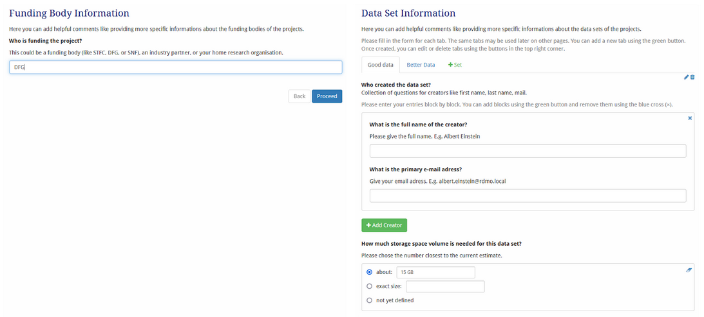

# Guide to develop a catalog in RDMO

## Introduction

This document is a guide to creating catalogues. It contains step-by-step instructions for creating a simple Catalog. If you have never created a Data Management Plan (DMP) catalogue in RDMO, it is recommended that you work through these steps on your own instance of RDMO.  
You will be introduced to important RDMO concepts, terminology, structure, hierarchies and dependencies, and can then apply this knowledge to create your own catalogue.  
RDMO is a tool for creating DMPs. A DMP is a documentation of the RDM practices of your research project over the entire data lifecycle. RDMO offers several DMP catalogs, whether for a specific funder or discipline, or just generic templates for any research project. A Catalog is a set of questions about data management practices throughout the data lifecycle, so it's a comprehensive set of questions to think about and document all the data and data management practices for your research project.  
Specialist users of RDMO with administrative rights (or have the role of editor) can customise the Catalog or create new Catalogs.  
Before deciding to create a new Catalog, you should check whether you have the rights to do so and whether there is already a catalogue that meets your needs.

## Explanation of the general relationships

Hierarchy of the elements of a Catalog 
Some might also call it Questionnaire or Interview, depending on the version, they are working on.


> *Overview of the RDMO Hierarchy*
  
Catalogs consist of (thematically distinct) Sections, which may span multiple pages. Pages are essentially (the entire scrollable area of) screens containing the questions (possibly organised into question sets). Questions can be of different types, distinguished by the type of response expected (e.g. text box, checkbox, date picker or range slider).

The creation of a new [*Catalog*](#catalog) must be done in this order, and this is the order in which it is described in this [manual](#getting-started).

## Getting started

Before we can start creating our new [*Catalog*](#catalog), we need to make sure your RDMO is set up correctly.

**Requirements**

* A running RDMO instance. In this guide, we assume that we are using a freshly installed RDMO instance of version 2.X or higher.
* A user with at least the Editor Role. Administrator privileges are not required. For more information see [role management](../administration/users.md#roles).
  * Check that you can see `Management` in the top navigation bar. If so, you are an Editor and can create a new Catalog.  
* The newly installed RDMO instance is still empty, i.e. there are no questionnaires, attributes, views, etc. available. 

### Import Attributes

If not already done, import the default [*Attributes*](#attributes) first (you will need them later):

* [Download the default attributes](https://github.com/rdmorganiser/rdmo-catalog/blob/master-rdmo2.x/rdmorganiser/domain/attributes.xml) (an xml file `attributes.xml`). You can rename this file as you wish.  
* Go to the `Management` section in the top navigation bar.  
  Select the previously downloaded XML file from the import option on the right hand side of the web page and click on the `import` button.    


> *Import XML File*
    
* In the next step, RDMO will show a summary of all the *Attributes* that will be imported. Continue with the import button at the top. It may take a while for the "import successful" message to appear.

```{admonition} Caution
 If Attributes, Options, and Option sets are imported and they already exist, they will be updated. Any local customisation of the default Attributes / Options will be overwritten. 
 ```

### Import options and [*Option sets*](#option-sets)

If not already done, import the default option sets:

* [Download the default option sets](https://github.com/rdmorganiser/rdmo-catalog/blob/master-rdmo2.x/rdmorganiser/options/optionsets.xml)  
* Go to the `Management` section and `import` the  "optionsets.xml" file in the same way as you imported the attributes before. RDMO will again show you a summary of all the option sets being imported.  
* Continue with the import button.

## Building your first Catalog

In this guide we will show you how to create a simple catalog to help you get started. We will show you how to create a catalog with two sections and two pages. All the steps we provide can be repeated to create a full catalog.

The [*Catalog*](#catalog) we have in mind should ask for:
- the funding body of the project  
- the creators of each data sets and the size of each data sets

The funding (body) question should be on one [*Page*](#pages) and the [*Questions*](#questions) about the datasets on a second Page. Users can add datasets as they wish, and each dataset can have multiple creators.

In the end, the Catalog should look something like this mockup:


> *Empty Project Page*

The Page on the left shows the Question about the funding body, and the Page on the right allows users to create different tabs (one for each dataset). For information about the creator(s) of the dataset(s), different creators can be added using the button below the last creator.

### Initial setup

You should see a screen like this when you open RDMO:


> *First Page after Login*

Click on `Management` in the top navigation bar. In a fresh RDMO it will look like this: 


> *Creating a new Catalog*
   
Check that the heading under management is [*Catalogs*](#catalog), if not click on `Catalogs` in the right-hand navigation pane.

```{admonition} Info
While many RDMO instances will already have existing [*Catalogs*](#catalog), this guide assumes that the RDMO instance is completely empty. This ensures that our screenshots are free of distracting elements, making it easier to focus on the process. If your instance contains some catalogs, that’s fine — this example will still apply.
```

### Creating a new Catalog

Now let us create a new [*Catalog*](#catalog). Click on the `New` button at the top-right corner. You should now see something like this:   


> *Creating a Catalog - Overview*

There are several fields we need to fill in:

* The [*URI Prefix*](#uri-prefix) should already be set by your administrator. Although you can choose a different `URI Prefix`, such as your institution’s URI, it will be used to indicate where the [*Catalog*](#catalog) was created.  
* If you change the prefix and wish to revert to the default value set for the RDMO instance, you can simply click on the "magic wand icon" to reset the entry back to the default value.  
* The [*URI Path*](#uri-path) should be a unique label for your [*Catalog*](#catalog). Choose a label that is appropriate for your purpose. In our example, we choose to have *"[http://rdmo.local](http://rdmo.local)"* and *"example-catalog"* as the `URI Prefix` and `URI Path` respectively. 


> *URI of the created Catalog*
  
    
* The `Comment` text box is an input field that will later only be visible to managers or administrators. It can be used, for example, to indicate recent changes or who is responsible for maintaining the Catalog.  
* The “available” button indicates that the catalog is available for use by the users. If the button is unchecked, users cannot see the catalog in the list.  
* By activating the “locked” button, only Admins can edit this Catalog.   
* The `Title` text box is for the title of the Catalog. We choose "*Meaningful Catalog*".  
* In the `Help` text box, you can enter details about the Catalog. This text will be visible to the users in the catalog overview when they create a project. So the help text should explain what this catalog is intended for (e.g. it is specifically designed for art history research projects).  
* If your RDMO supports multiple languages, you should fill in all the fields in all the languages.   
* You can also give your new Catalog an order. The order is just a number that determines the order in which the Catalogs are displayed in the various RDMO menus. If the RDMO instance has just been set up, any small number should be fine (e.g. "1").


> *Explanation of the Fields*

```{admonition} Info
If you also see the `Sites` and `Editors` fields , you are on a hosted RDMO service / multi-site instance of RDMO. *Sites* allows you to specify on which sub-instances the *Catalog* will be available and *Editors* allows you to select who can edit the *Catalog*.
```


> *Sites and Editors*

For the next step, click on `Create and continue editing` at the bottom of the page.

### Creating Sections

We will now add a first [*Section*](#sections) to this [*Catalog*](#catalog). Note that you can reuse an already existing *Section* from other [*Catalogs*](#catalog) available on your RDMO instance. Here we will create a new *Section*.

Under the heading "*Sections*" click on `Create new section`. You should now see something like this:


> *Creating Sections*

By default, RDMO displays the *URI Path* of the [*Catalog*](#catalog) the [*Section*](#sections) is attached to \- in our case "*example-catalog*". Change the `URI Path` according to the content of the section. There are currently no best practices in the RDMO community but try to be consistent within your catalog. Here we choose “example-section-01”.

Note that you must use a different `URI Path` because each object in RDMO needs a unique URL. Otherwise, RDMO would not know which object you want to include in your DMP questionnaire. If you accidentally choose a `URI Path` that is already in use, RDMO will complain when you try to save.

Enter the `Title` of the [*Section*](#sections). This will be displayed prominently in the questionnaire. You can enter a `Short title` for this *Section* which will replace the long title in the navigation bar displayed to users of the catalog. 

Click `Create and continue editing` to create the new section.

At the top of the web page you should now see that the section is being used in a Catalog. You can click on the down arrow to view this catalog. It is the one we have just created. If you reuse this section later in another [*Catalog*](#catalog), it will also appear here.


> *Indicator how often a Section is used in different Catalogs*

### Creating Pages

We will now create our first [*Page*](#pages). An RDMO page contains [*Questions*](#questions) that are presented to the user on a single web page/screen. Think of a *Page* as the analogue of an actual paper page in a classic questionnaire. We recommend that you do not put too many questions on a page \- users do not like to scroll.

To create a Page, click Create Page in the Section we created in the previous step. Again, you could reuse an existing Page, but we are going to create a completely new one.. 


> *Creating a Page*

* Make sure that the [*URI Path*](#uri-path) is unique. You can change this as shown in the previous steps.  
* Fill in the page `Title`. In our case, we use "*Funding Body Information*" for the title. It will be displayed prominently at the top of the [*Page*](#pages) in the questionnaire.  
* Next, we enter the `Short title`. This will be used in navigation bars and menus. We will use "*Funding*" as the short title.  
* You can also use the `Help` field to provide useful information for users, such as explaining what this [*Page*](#pages) is about.  
* Now click on the button `Create and continue editing`.


> *Creating a Page*

**What we do not need to fill in:**

Note that we do *not* check if it `is collection`, we do *not* fill in the `Name` field, and we do *not* assign an `Attribute`. You only need these fields if the page is to be a Collection. We will explain what this means in detail when we create our second page.

We will also ignore the `Conditions` part for now. This feature allows us to show or hide pages (and [*Question sets*](#question-sets) and [*Questions*](#questions)) depending on the user's answers to previous questions. We will skip this feature for this basic guide.

### Adding Questions to Pages
We will now add a new element to our page. Elements can be [*Questions*](#questions) or *Question sets*. In our example, we want to use this first [*Page*](#pages) to ask [*Questions*](#questions) on the project’s funding, so we will click on `Create new question` in the *Elements* area.


> *Add Elements to the Page*

* Fill in the `URI Prefix` and `URI Path` as before. Note that the path must be unique.  
* In the `Text` field, type the [*Question*](#questions) you want to ask. Here we have written, *"Who is funding the project?"*.  
* The `Help` field again provides helpful information. In this case, here is an example of an entry:


> *Create a Question*

* **Other remarks**: We do not need the `Name` field, as the [*Question*](#questions) is **not** a [*Collection*](#collection). But it would be no problem to enter some text in this field.  
* Next, we will select an [*Attribute*](#attributes). In the next sections we will look at the use of attributes in more detail. For this example, we have chosen

https://rdmorganiser.github.io/terms/domain/project/funder/name 

```{admonition} Info
**Important Note**: Each *Attribute* must only be used **once** in a *Catalog*. If you use an *Attribute* twice, the answers to different *Questions* will overwrite each other. There is only one exception, where an *Attribute* can be used more than once. We will cover this later when we create the next *Page*.
```

* The ['Widget type'](#widget-type) allows you to define the type and answer possibilities of your current [*Question*](#questions) (e.g. `Textarea` for longer answers, `Text` for short answers or `Radio buttons` for pre-defined answers).  We will cover radio buttons and pre-defined answers later when we create the [*Question set*](#question-sets). For now, we will choose `Text,` as usually only a short line is needed for names.  


> *Provide a Widget type*

* You can now click on the `Create` button. This [*Question*](#questions) form will close and you will be returned to the [*Page*](#pages) you came from. Click `Save` to save your changes.

### Creating Pages as a Collection

Now we are going to create a second [*Page*](#pages) that will be a [*Collection*](#collection). In our example, we want to use this page to ask [*Questions*](#questions) about the datasets created in a project.

By making the page a collection, we are telling RDMO that we want to allow users to answer the questions on this page multiple times \- each time for a part of the collection. In our case, they can give separate answers for each dataset. 

* If you saved our previous page and proceeded, you should now be back at the *Section* level. To create a second [*Page*](#pages), simply click `Create Page` again.  
* If you have accidentally closed the *Section* window or taken a break, you can also start by clicking on `Catalogs` on the `Management` page. This will display all the available [*Catalogs*](#catalog). Find your new [*Catalog*](#catalog) (you can search for a phrase to reduce the number of catalogs shown) and click on the first icon to the left of the pen icon, in our [*Catalog*](#catalog) entry.  This will display the current structure of the *Catalog*. Find the *Section* and click on the pen icon to start editing. Then click  on `Create Page` on the *Section* screen.


> *Unfold a Catalog to edit it*

* Make sure that the [*URI Path*](#uri-path) of the new *Page* is unique. You can change it as shown in the previous steps.  
* Enter the *Page* `Title`. In our case, we use "*Dataset Information*" for the title. It will be displayed prominently at the top of the [*Page*](#pages) in the questionnaire.  
* Next, we enter the `Short title`. This will be used in navigation bars and menus. We use *"Data Info"* as the short title.  
* You can also provide useful information for users in the `Help` field, e.g. explain what this [*Page*](#pages) is about.  
* Click the checkbox next to `is collection`.


> *Creating a Page as a Collection*

```{admonition} Info
**Background information**: A [*Page*](#pages) that is a [*Collection*](#collection) will have several tabs. Each tab will contain the same [*Questions*](#questions) (and [Question sets](#question-sets)). A common case is a project with several datasets. The datasets are quite different and you expect researchers to give different answers to the same [*Question*](#questions) for each dataset. For example, you want to ask whether the data contains personal information. A project may have datasets with and without personal data. So it makes sense to create two datasets. Each will correspond to a different tab on a [*Page*](#pages).
```

RDMO *Pages* that are Collections will show tabs like this:


> *Default Tab Name*

In the figure above the user has already created two tabs: "\#1" and "\#2". Each tab will contain the same *Questions*. However, using numbers to label the tabs is not ideal because the datasets corresponding to the tabs should have names or at least some meaningful classification such as "*Interview Data*" or "*Simulation Output*". Let's move on to the next step to fix this. 


> *Customised Tab Name*

* The input field `Name` is the label displayed on the button that allows you to add a new tab.  If you do not specify a `Name`, RDMO will use the generic term "*Set*", as shown in the screenshot above. We choose "*Dataset*" as the button label. Here is an idea of how it will look like to the users later on: 


> *Customised Tab Name* 

* The next step is to select an [*Attribute*](#attributes) (note: we did not do this for the first page we created). When you make a page (or later a questionset) a [*Collection*](#collection), you should always assign an [*Attribute*](#attributes) to this page. 

Now, click on the drop-down menu. You will see all the attributes that your RDMO instance contains. As we have imported the default RDMO [*Attributes*](#getting-started), you should already see a large number of possible attributes. As we want to have tabs corresponding to datasets, we select the attribute:

https://rdmorganiser.github.io/terms/domain/project/dataset/id

Note the semantics of the [*Attribute*](#attributes) name. A **project** will have **datasets** and a dataset will have an **id** (e.g. its name or an acronym \- this will be set by the users when they fill in the questionnaire in RDMO).

Instead of scrolling, you can also start by typing "dataset". This will reduce the options the drop-down menu offers.

```{admonition} Info
**Why did we assign an attribute to the page?** Remember that by checking `is collection` we have ensured that the page will have tabs. By assigning an *Attribute* to this *Page*, we give the users the ability to give the tabs a label of their choice. Without an *Attribute,* the tabs will simply be labelled "\#1", "\#2", "\#3", etc. If we want to give the users the ability to name their datasets, we need to assign an *Attribute*. It is common practice to assign an attribute called *".../id"*, if available. The *Attribute* is needed by RDMO to be able to access the user input later.
```

```{admonition} Info
**Using one Attribute multiple times?** If we later want to ask for additional information about the datasets in the questionnaire, we could create an additional page, make it a collection and assign the **same** *attribute* (e.g. [*https://rdmorganiser.github.io/terms/domain/project/dataset/id*](https://rdmorganiser.github.io/terms/domain/project/dataset/id)). RDMO would then know that this page will also have a tab for each dataset. This is the **only exception to the rule of never using the same Attribute more than once**.

This is very useful if your questionnaire is longer. We will not use it in the short DMP example we are building in this guide.
```

* Now click on the button `Create and continue editing`.

**What we do not need to fill in:**

We will also ignore the `Conditions` part for now. This feature allows us to show or hide pages (and [*Question sets*](#question-sets) and [*Questions*](#questions)) depending on the user's answers to previous questions. We will skip this feature for this basic guide.

### Adding Question sets to Pages

We are now going to add new elements to our page. Elements can be [*Questions*](#questions) or a [*Question set*](#question-sets). In our example, we want to use this second page to contain a *question set* that collects information about datasets. We could add existing ones by clicking on ´Add existing element´ in the *Elements* area, but in this case we will click on `Create new question set`.


> *Adding Elements to the Page*

### Creating a new Question set

Again, there are several fields we need to fill in to create a new [*Question set*](#question-sets).

* We want to query the creator(s) of the dataset. So we will fill in the usual fields ([`URI Path`](#uri-path), `Title`, `Help`, `Name`, etc.) accordingly:


> *Create a Question Set*

* Since a dataset can have more than one creator, we want to be able to add (additional) creators. So we will make this [*Question set*](#question-sets) a [*Collection*](#collection). This will cause RDMO to display a button below the block to add another question block like this:


> *Exemplary Question for Collections*

* For the [*Attribute*](#attributes) we have selected:  
 `https://rdmorganiser.github.io/terms/domain/project/dataset/creator`  
    
* The label of the button is set by the `Name` field \- in our case "*Add Creator*". This is analogous to the case of a *Page,* where the label for adding a new tab was set by the `Name` field.  
    
* Now click on `Create and continue editing`.

### Adding Questions to Question sets

We are going to add a [*Question*](#questions) that asks for the name of the contributor. To do this, we click on the `Create new question` button. If we do this in the context of our current [*Question set*](#question-sets), the [*Question*](#questions) will automatically be linked to the question set.


> *Including Questions into Question Sets*

* Make sure that the `URI Prefix` and `URI Path` are unique.  
* The `Text` is the [*Question*](#questions) you want to ask. Here we can write *"Enter person's full name"* or *"What is the creator's name?"*.     
* The `Help` field again can be used to provide helpful information. In this case we give an example of an entry.     
* We do not need the `Name` field, because the [*Question*](#questions) is **not** a [*Collection*](#collection). But it would be no problem to enter some text in this field.      
* We also need to specify an attribute. We choose the appropriate [*Attribute*](#attributes)  
  `https://rdmorganiser.github.io/terms/domain/project/dataset/creator/name`  
    
* The [`Widget type`](#widget-type) allows you to define the type and the answer choices of your current [*Question*](#questions). E.g. `Textarea` for long answers, `Text` for short answers, or `Radio buttons` for predefined answers.  We will look at radio buttons later when we add a second [*Question*](#questions) to this [*Page*](#pages). Here we will choose `Text`, as usually only one line is needed for names.     
* Now click on `Create`. This should take you back to the [*Question set*](#question-sets). You should also see that the [*Question set*](#question-sets) now has one item: the [*Question*](#questions) we just created.

**Adding a second Question to our Question set**

Let us add a second [*Question*](#questions):

We add a new [*Question*](#questions) to ask for the primary email address of the creator.


> *Including a second Question into the Question Set*

* Fill in the necessary fields as explained earlier. For this [*Question*](#questions) we will again use the widget type `Text` and use the value type `E-mail`.  


> *Set up the Widget Type*
         
* When looking for a fitting attribute, we do not find a perfect match. For the sake of simplicity in this guide, we choose  
   `https://rdmorganiser.github.io/terms/domain/project/dataset/preservation/responsible_person/email`  
    
But it is not ideal, as the semantics indicate that it is the e-mail address of a person responsible for the preservation of the dataset. We could also create a new attribute, but we want to avoid this extra work for now.  
    
* Click on `Create` and finish creating this [*Question*](#questions). You should now be back at the level of our [*Question set*](#question-sets). At the bottom of the *Elements* pane, you should now see the two questions that are part of this [*Question set*](#question-sets).


> *List of elements within a Question Set*

* Now we are going to add an additional [*Question*](#questions) to our [*Page*](#pages) that is not part of the [*Question set*](#question-sets). Click on `Save`.
* Then click on Pages on the *Navigation bar* on the right. RDMO will display a list of all *Pages*. Type in the filter field to find our *Page* called "Dataset information" (or the title you chose).


> *List of Pages*

* Click on the edit (pencil) icon to edit the *Page*.

### Adding Questions to Pages

We will now add another new element, a [*Question*](#questions), to our *Page*.
* Click on `Create new question` in the *Elements* area.


> *Adding Elements to a Page*

This time we want to create a radio button where users can choose how much storage space is required for the dataset.


> *Create Storage Question*

* Fill in the default fields as before.      
* Assign the [*Attribute*](#attributes)   `https://rdmorganiser.github.io/terms/domain/project/dataset/storage`  

* Use [*Widget type*](#widget-type) `Radio button` and the *value type* `Options`.  


> *Choose a Widget Type*
        
* Now, click on `Option sets` and on `Add existing optionset`. We choose    `https://rdmorganiser.github.io/terms/options/dfg_dataset_size_options`   
as [*Option set*](#option-sets).


> *Selecting an Option Set*

```{admonition} Info
**Why did we choose the radio button?** In this scenario, we want to give the user multiple choices and allow them to select one. This is achieved by using the "Radio button" Widget type. When choosing this widget type, we also need to tell RDMO where to find the answer choices. This is done by selecting the value type *Options* and then assigning an *Option set* to the *Question*. *Options sets* contain answer choices that can be used. Here we use an *Options set* that does what we want it to do.

It will take some time to get to know all the options that RDMO provides through the default *Option sets* that we installed at the very beginning of this guide. You can also create your own *Option sets* and *Options* and share them with the community if you wish. However, this is covered in a separate guide.
```

* Once you have selected your optionset, click on the `save` button. This [*Question*](#questions) form will close and you will be returned to the [*Page*](#pages) you came from. Click `save` again to save your changes.

### Check that everything has worked

* Click on `Catalogs` In the right-hand navigation area. This will display all available [*Catalogs*](#catalog). Find your new [*Catalog*](#catalog) (you can search for a phrase to reduce the number of catalogs shown).  
* Next click on the first icon to the left, left of the pen icon, in our [*Catalog*](#catalog) entry. 


> *Catalog Overview*    
            
You will see this:


> *Catalog Overview if unfolded*

This picture shows the entire structure of the [*Catalog*](#catalog). This representation is also very useful if you want to add to or modify an existing [*Catalog*](#catalog). Note that you can edit any component by clicking on the corresponding pen icon. The rightmost icon (double-crossed arrows) can be used to rearrange the order of items. [Icons](#icons)

* Now go back to the RDMO home page (you can usually just click on the name of the RDMO instance in the top navigation bar \- it is on the very left).

You are now in the overview of all your available projects. In our case, this is an empty list.

### Creating a first project with the new catalog

Click on `New project`


> *Empty Project List*

Give the project a `Title` and choose our new [*Catalog*](#catalog) "*Meaningful Catalog*". Add a nice description and click on `Create project`. 


> *Provide Project Informations*

Now go to `Answer questions` (at the top right area of the page).

This is what you should see:


> *Project Page*

Create a first *Dataset* by clicking on the `+Dataset` button (this will generate your first tab on the page) and give it a descriptive name. 


> *Add a new dataset to your anwsers*

The [*Page*](#pages) should now display our [*Question set*](#question-sets) for the creators and the single [*Question*](#questions) regarding storage volume. The title you gave the dataset should now be displayed in a tab, and you can add more tabs (for more datasets) by clicking on the `+Dataset` tab. Recall: this is why we ticked the `is collection` box in the [*Page* form](#creating-a-page-as-a-collection).

You can fill in the first creator's data. Note that there should be a button to `+ Add Creator`. Press it and see if an additional field for a second creator appears. 


> *Add a new Creator*

Finally, you should see a radio button menu. The available options are defined in the [*Optionset*](#option-sets) that we linked when [setting  up the question](#add-elements-to-our-page-questions). If we wanted different options, e.g. different data volumes, we would have to create a new [*Optionset*](#option-sets). 

## How to add Options to your RDMO

If you have never created a [*Catalog*](#catalog) in RDMO before, we recommend you start with the step-by-step guide to [Creating a new Catalog](#creating-a-new-catalog). Creating new [*Options*](#options) is easier than creating a new questionnaire, but knowing the parts of a questionnaire (called a *Catalog* in RDMO) will help you understand what *Options* are for.

We will assume that your RDMO already has the default domain with *Attributes* and the default *Options* (see [Initial setup](#initial-setup) for a guide to installing these).

In this example, we want to offer users a selection of experimental techniques for an \[\[Omics\]\] project. Since  *Options* in RDMO are grouped in [*Optionsets*](#option-sets). We will start by creating a new *Optionset*.

### Creating a new Optionset

First, navigate to the *Management* section in RDMO. This can be done by clicking on  *Management* in the top navigation bar. Then click on *Option sets* in the navigation area on the right. 

Click on the *New* button at the top-right corner to start creating a new *Option set*.

The top fields in the form *URI Path* and *URI Prefix* should be familiar from creating *Catalogs* \- if not, have a look at [this section](#creating-a-new-catalog).

The comment field can be used to give RDMO managers an idea of what the option set is about and how it will be used. We enter *"This option set provides various experimental methods for omics research. Intended for offering users a specialised selection of methods used to create a generated dataset."*

The order determines where the new set will appear in the list of option sets. Choose any number that makes sense.

You can use the *Locked* checkbox to prevent the set from being changed. We leave it unchecked.

Now click on "Create and continue editing" at the bottom.

### Adding Options and additional properties of an option set

You will notice that it is possible to add *Options* to this *Option set,* as well as *Conditions* and a *Provider*. For this simple case, we will skip Conditions and also *Option* *Providers* \- there will be separate tutorials for these more advanced features later.

For now, we want to add a new *Option* to this *Option set*. We will add existing options later.

Click "Create new option".

### Creating a new option

* Again fill in the *URI Path* and, if empty, the *URI Prefix*.  
     
* Next, fill in the *Text* (this is what RDMO will display to users) \- it should be short. We choose "DNA Methylation Assay".  
     
* Optionally, you can also enter the *Help* text for users. This additional text will be displayed in light grey with the *Option* *Text*.  
     
* The *View text* is only used by RDMO in views and can be used to provide a more detailed text for the option.  
     
* Next, the *Additional input* field must be selected. We do not need a text field or a text area for this option, so we select "-----". We will use a different choice later in this guide.  
     
* Finally, click *Create*.

### Creating a second new option with additional input

You should be returned to the original *option set*.  The new option should be displayed. Let us add another *Option* to this *option set*.

Click on *"Create new option"* again. We want to add "spatially resolved transcriptomic" as a broader approach and allow the users to add their specific flavour of method in a text field.

We add *URI Path* and *Text* as well as *Help* and *View Text* as follows:

* URI Path: option_SRT  
* Text: spatially resolved transcriptomics  
* Help: Add the specific techniques (e.g. GeoMX DSP, PIXEL-seq or DNA-MERFISH) in the text field.  
* View text:  Single-cell spatial transcriptomics methods will be used, in particular

This is identical to the first *Option* we created. Now we still need to allow the users to add the specific methods as our help text suggests.

Click "Create".

### Add an existing Option

You should now be back with your *Option set*. We are going to add a final third *Option* that already exists.

Click on "Add existing option". A drop-down menu will appear containing all the *Options* available on your RDMO instance.

If you installed the default RDMO *Options* you should already see quite a few.

Click on the drop-down menu. Start typing and type "documentation/other".

You should only see one entry.  Click on it. We will see what this *Option* does when we use our *Option set* in a *Question*.

Click "Save" at the bottom.

### Use the option in a Question

Finally, we need to use the option in a Question. If you already know how to add *Questions* to a *Catalog* try it yourself.

If you do not know how to do this: Go through the [Creating a new Catalog](#creating-a-new-catalog) tutorial, except in the [Add a *Question* to our *Page*](#add-elements-to-our-page-questions) step, you can add your new *Question set* instead of the one suggested there. The question text won't fit exactly, but you will see your *Question set* in action.

## Understanding Attributes

* *Attributes* are at the heart of RDMO, linking content elements to project values. They play a crucial role in ensuring consistency and interoperability across different [*Catalogs*](#catalog) and RDMO instances.  
* The answers given by a user are stored in this attribute and are not lost. This can be an advantage, as the answers will be displayed even if the user changes the catalog within a project created in RDMO. At the same time, however, there is a potential for danger:  
  * If you use a particular attribute for a certain question in the first catalog, but the same attribute for a different type of question in another catalog, the answers that were first entered by the user first will be retained, but may no longer make sense. If the user overwrites them in the second catalog, they will no longer make sense for the first catalog when they switch again.  


> *One Attribute for different Contexts*
    
  * The answers stored in the attributes are only exchanged within a project. If the user creates another project in which they answer a different catalog, no information is transferred.  
* The RDMO domain contains 304 (01/25) hierarchically ordered attributes covering most aspects of RDM.  
* The attributes are logically divided into three parts:  

1. URI Prefix: A character string structured as an URL. The default RDMO URI Prefix is the address of the institution, such as „https://your-institution.de/terms“.  

2. Element type (in this case "/domain/")

3. URI Path

a)  URI Path: The path provides information about the content of the question, with the scope being defined more and more concretely through the hierarchical structure. Separated by slashes, you work your way forward until you reach the “key”. As the name of the attribute should reflect the information expected when answering the question, the scope can be narrowed down.

- For example, if you want to ask who is the project manager for a project, proceed from the general to the specific as follows: All in all, these are project-specific questions. So the top level of the path is the “project”. Then you want to get general information about its coordination, so you select “coordination” next. As you are looking for a person, the next level would be “name”. The full attribute is then “ https://rdmorganiser.github.io/terms/domain/project/coordination/name”.

b)  URI Key: The key within the path is the last word, which is separated by a slash, and represents the most concrete level for identifying the question.

-  The URI path can be very short, containing only a few terms, or it can be very long, depending on how many levels there are. It is advisable not to make the structures too specific so that the area does not become too small and the attributes can be better used.

* When creating a catalog, each [*Question*](#questions) must use an attribute, which appears only once in it.  
* [*Question sets*](#question-sets) can also be linked to an attribute as well. The default attribute here is "https://rdmorganiser.github.io/terms/domain/project/dataset/id".  
  * The use of attributes for Question sets does not affect the questions presented to users. Only when the „is collection“-Button is enabled can the user create „datasets“ when answering the catalog:  


> *Provide Datasets*
    
* Overview of existing *Attributes* and usage: [Attribute Overview](https://rdmorganiser.github.io/terms/)

### How to choose an Attribute

There is no best practice on how to choose an attribute so far. If you’re not sure, please contact the RDMO group.  

* The steps you can take are the following:  
  * Review Existing *Attributes*: Familiarize yourself with the [RDMO domain](https://github.com/rdmorganiser/rdmo-catalog/blob/master-rdmo2.x/rdmorganiser/domain/attributes.xml), which contains 304 (01/2025) hierarchically ordered attributes. Identify the specific information your [*Question*](#questions) is trying to capture and look for *Attributes* that closely match your intent. *Attributes* in RDMO are organized in a tree-like structure, so navigate through the hierarchy to find the most relevant category. You can also have a look into [RDMO Terms](https://rdmorganiser.github.io/terms/) to find questions and their related attributes.  
  * Check *Attribute* Properties: Each *Attribute* has properties such as URI, key, and parent. Ensure these properties align with the context of your [*Question*](#questions). Example: The *Attribute* with the path `project/schedule/project_start` represents the start date of a project. The *Attribute* key is `project_start`. Its parent *Attribute* is the `project/schedule` *Attribute*, which itself is a sub-Attribute of  `project`. When creating a [*Page*](#pages) [*Collection*](#collection), you should select the appropriate *Attribute*. ![Overview of available Attributes][image27]  
      
**Cases where you'll need to create a new Attribute:**  

* Be sure that there is no matching attribute\! Even if the name of an attribute does not literally reflect the question, they are open enough to cover similar question content. For example, if you want to query when a campaign starts (instead of a project), you can still use the attribute “https://rdmorganiser.github.io/terms/domain/project/schedule/project_start” (if you have not already used it in the catalog), because you want to have similar pieces of information.  
    * Discipline-Specific Information: when capturing data unique to your field that isn’t covered by existing *Attributes*. Example: Specialized lab techniques or data formats or Institution-Specific Requirements: For information specific to your institution’s policies or processes.   
    * New RDM Aspects:  
      If addressing a new area of Research Data Management not currently in the existing *Attribute* set.  
  * If you have created a new attribute, the catalog is no longer so easy to reuse. When setting up an RDMO instance or a release, only the attributes that are in the domain are implemented  
    * You can contact the RDMO group and ask to include your attribute in the domain as well.  
    * You must provide the .xml including your attributes when sharing the catalog. The document describing the attributes has to be uploaded before the catalog. When sharing the “XML full” catalog, this remark is not relevant.

## How to use Conditions in your Catalog

RDMO offers the option of skipping or hiding questions that are not relevant to users with the help of  *Conditions*. This is controlled by a so-called decision question. For example, if users click on the answer option “No, no sensitive data is used”, the subsequent questions about sensitive data are automatically skipped. If a question has multiple answer options, a different condition can be selected for each option, resulting in different behaviour depending on the answer selected. For example, different *Questions sets* can be displayed or skipped. Conditions are always linked to [*Option sets*](#option-sets), [*Questions*](#questions), or [*Tasks*](#tasks) and disable or enable them. They can also be used in [*Views*](#views).

We strongly recommend that you only create and use [*Conditions*](#conditions) after you have compiled a complete list of [*Questions*](#questions), because [*Conditions*](#conditions) cause [*Questions*](#conditions) to be skipped or hided. If you create and use [*Conditions*](#conditions) too early, this can have the unintended effect of your questions not being displayed in the [*Catalog*](#catalog). 

### How to create new Conditions

First, navigate to the *Management* section in RDMO. This can be done by clicking on `Management` in the top navigation bar. Then click on `Conditions` in the navigation area on the right and all [*Conditions*](#conditions) available will appear. You can filter the *Conditions* using search terms, or by the URI prefixes used or the site in the case of a multi-site instance.

Click on the *New* button in the top-right corner to start creating a new *Condition*.

The top fields in the form *URI Path* and *URI Prefix* should be familiar from creating *Catalogs* \- if not, have a look at [this section](#creating-a-new-catalog).

The comment field can be used to give RDMO managers an idea of what the [*Condition*](#conditions) is about and how it will be used. We enter *"This condition checks whether sensitive data being handled in the project"*

You can use the ``Locked` checkbox to prevent the *Condition* from being changed. We leave it unchecked.


> *All condition settings*

The Source defines which [*Attribute*](#attributes) is evaluated by the *Condition.* You select an *Attribute* from the *Catalog* (or you can create a new *Attribute*), and the value stored for this *Attribute* in the project is compared against the *Condition*’s target value. Whatever value the user enters or selects for that *Attribute* will be used in the comparison.

The *Relation* defines **how** the value of the source *Attribute* is compared to the target value. The *Condition* relations include:
    
| Relation                           | Description                                                                       | Target </br> (Text) | Target </br> (Option) |
|-----------------------------|-----------------------------------------------------------------|:----------------:|:-------------------:|
| **is equal to (==)**           | Checks whether the answer </br> is exactly this text or option         |       ✓       |        ✓        |
| **is not equal to (!=)**     | Checks whether the answer </br> is any text or option other than this one     |       ✓      |    ✓   |
| **contains**      | Checks whether the text answer </br> contains the given text fragment         |       ✓       |        –        |
| **is greater than (>)**     | Checks whether the numeric answer </br> is greater than the given value   | ✓ |  –   |
| **is greater than or equal (>=)**  | Checks whether the numeric answer </br> is greater than or equal to the given value  |       ✓       |   –  |
| **is less than (<)**   | Checks whether the numeric answer </br> is less than the given value  |  ✓   |     –    |
| **is less than or equal (<=)**     | Checks whether the numeric answer </br> is less than or equal to the given value  |  ✓  |   –    |
| **is empty**   | Checks whether no answer has been given                                                |       –       |        –        |
| **is not empty**   | Checks whether any answer has been given                                               |       –       |        –        |

The last two relational operators **is empty** and **is not empty** do not require a target value.

The *Target* is the value the source attribute is compared against. Depending on the attribute, this may be:

* *Text*: a string, boolean value or number to compare with the attribute value
* *Option*: one of the predefined options (in *Option Sets*) associated with the attribute

The correct type of target depends on the attribute’s configuration in the *Catalog*.

#### Conditions with a Target Text (including strings, boolean values, numbers)

In RDMO, text targets are used not only for strings but also for boolean values and numbers, depending on the type of the source attribute.

*Text values*: For attributes that store plain text, the target is a literal string. Text comparisons are case-sensitive meaning that uppercase and lowercase letters must match exactly for a condition to evaluate as true. This allows precise control when checking specific text values but also requires that the target be entered exactly as the attribute value appears.

As relation you can choose between

* is equal to
* is not equal to
* contains

*Boolean values*: Boolean attribute values are represented as numeric strings (1 = yes, 0 = no). Use these values as the target when you want the *Condition* to check whether a user selected **yes** or **no** in a boolean question.

As relation you can choose between

* is equal to
* is not equal to

*Numbers*: For numeric attributes, the target must be a plain number. These targets are written as plain numbers without additional formatting.

As relation you can choose between

* is equal to
* is not equal to
* is greater than
* is greater than or equal 
* is less than
* is less than or equal

#### Conditions with a Target Option

In addition to targeting text answers, [*Conditions*](#conditions) can also be used to check selected options. In the condition settings, you can select a specific option in *Target (Option)*. For this to work correctly, do not add any text to the *Target (Text)* setting.

Not all relations work with options, you can choose between two relations for *Target (Options)*:
    
* is equal to
* is not equal to

You can not select multiple options.

#### Select *Editors* (only in multi-site instance of RDMO) 
In a multi-site RDMO installation, you can control which user groups are allowed to edit a [*Condition*](#conditions). Under *Editors*, you can link one or more groups of *Editors*. Only members of the assigned groups will be able to modify the Condition.

### How to add a condition to your Catalog

#### Adding *Conditions* to *Sections*, *Pages* or *Question Sets*

* Open the *Section*, *Page* or *Question Set* where you would like to add the condition
* Scroll down to *Conditions* and Click on `Add existing condition`. A drop-down menu will appear containing all the conditions available on your RDMO instance. 
* Click on the drop-down menu and type the name of the condition you created
* After selecting your condition, click on `save`


> *Add a condition to a page*

#### Adding *Conditions* to *Questions*

* Open the *Question* where you would like to add the *Condition*
* Scroll down to *Conditions* and Click on `Add existing condition`. A drop-down menu will appear containing all the conditions available on your RDMO instance. 
* Click on the drop-down menu and type the name of the condition you created
* After selecting your condition, click on `save`


> *Add a condition to a question*

```{admonition} Info
If you add multiple [*Conditions*](#conditions) to a [*Question*](#questions), all conditions are combined with a logical OR, which means, if just one of those conditions is met, the element is visible.
```

## Adding Tasks to your RDMO

Using tasks you can add an additional layer to your RDMO [*Catalog*](#catalogs). Tasks are visible directly on the project page and can help users remember important data management tasks. Users can open a task to view its detailed description and see the related question in the interview. 

Each task is linked to a [*Condition*](#conditions) and to specific [*Catalogs*](#catalogs). When the condition is met, the task is displayed and users can interact with it and change its status (open, in progress, closed). This can be used, for example, to display a "Contact your Data Protection Officer" task when a user indicates in the interview that personal data will be collected during the research project. In addition, you can also use tasks for other purposes, e.g. to show recommendations, when a user selects certain options.

For each task you can define a time frame based on the project’s start and end dates. Tasks can then be displayed relative to these dates, for example one or two months after the project starts or ends.


> *A task on the project page*

### How to create new Tasks

First, navigate to the *Management* section in RDMO. This can be done by clicking on `Management` in the top navigation bar. Then click on *Tasks* in the navigation area on the right and all [*Tasks*](#tasks) available will appear. You can filter the *Tasks* using search terms, or by the URI prefixes used or the site in the case of a multi-site instance.

Click on the *New* button in the top-right corner to start creating a new *Task*.

The top fields in the form *URI Path* and *URI Prefix* should be familiar from creating *Catalogs* \- if not, have a look at [this section](#creating-a-new-catalog).

The comment field can be used to give RDMO editors an idea of what the *Task* is about and how it will be used. We enter *"This task reminds users to identify the rights owner and to contact them if the answer in the catalog indicates that this was not done yet."*

You can use the *Locked* checkbox to prevent a *Task* from being modified. By default, it is left unchecked.
The `*Available* button indicates whether the task is visible to users. If unchecked, the task will not appear in the user’s task list.
The *Order* determines the position of the task within the list of all existing tasks. You can choose any number that makes sense.

Next, you can add the short and meaningful title (e.g. *"Contact rights owner"*) and a description (field 'text') for your task. The description specifiy what one has to do to accomplish this task (e.g. *"Clarify, if and how this restricts the possibility of long-term preservation and re-use and if the rights onwer ist willing to grant the necessary rights."*). Both will be displayed in the project overview. 

Tasks depend on conditions. Each task must be linked to one or more conditions, and it will only be displayed if at least one of the conditions evaluates to true.


> *General task settings*

#### Make a task date sensitive

If your *Catalog* asks users to specify dates, e.g. start and end data of the project, you can use this information to schedule tasks in relation to the dates specified. 

With setting *Start date attribute* and *End data attribute* you can assign the related attributes of the questions. With *Days before* or *Days after* you can define in relation to the date stored in the attribute, when a task is visible.

#### Select at least one Catalog

The *Catalogs* field lets you choose the catalogs in which this task can be used. Not specifying a catalog and leaving the list empty implies that this task can be used with every catalog.


> *Date and Catalog task settings*

### How to add a task to your catalog

* Open the task settings
* Select your *Catalog* in the *Catalogs* setting at the bottom 

```{admonition} Info
If the *Catalogs* list is empty, the task is by default active for all catalogs. 
```


## Glossary: Basics

In this section, you will learn about the basic elements of RDMO to create your own questionnaire. To create a [*Catalog*](#catalog) in RDMO, you need to understand the hierarchical structure and the relationships between the different components. Here's a breakdown of how to build a [*Catalog*](#catalog) structure:

### Catalog

* The top-level container for your questionnaire  
* Contains multiple [*Sections*](#sections)  
* Once a catalogue has been completed it can be exported in a variety of formats.

### URI prefix

* A *URI Prefix* acts as a unique identifier for your RDMO instance, this is particularly important when different instances are sharing data.  
* The default *URI Prefix* can be set in the RDMO configuration file (local.py), which usually requires administrative access to change, so if it's defined, don't change it.

### URI path

* It is the part of the URI that comes after the prefix.  
* It is typically a string of characters separated by forward slashes ("/") and is primarily used as an internal identifier to locate specific items or resources within the RDMO system. When combined with the [*URI Prefix*](#uri-prefix), it forms the full URI of an item.

### Sections

* Main segments of the [*Catalog*](#catalog).  
* Each *Section* contains multiple [*Pages*](#pages).  
* *Sections* help to break the catalog down into thematic areas.

### Pages

* Subdivisions of *Sections* that contain and organise *Questions* and [*Question sets*](#question-sets)  
* A *Page* corresponds to a visible screen in the user interview process 

### Collection

* A collection in RDMO allows for multiple sets of answers to the same group of [*Questions*](#questions). You can select the collection option for a [*Page*](#pages), [*Question*](#questions), or [*Question set*](#question-sets). Each instance of a collection contains the same set of [*Questions*](#questions) but can have different answers, making it useful for cases where similar information needs to be entered multiple times. This feature creates more dynamic and flexible questionnaires that adapt to different project structures. For example, if you have a [*Page*](#pages) about "Dataset Description" and mark it as a collection, researchers can describe multiple datasets within the same project. This is particularly useful when collecting information about multiple datasets, research methods, or project partners in a single project.  
* At the [*Question*](#questions) level, a collection allows the answer field to a [*Question*](#questions) to be answered more than once.  
* At the level of [*Question sets*](#question-sets), the collection allows [*Option sets*](#option-sets) to be duplicated and used multiple times.  
* At the [*Page*](#pages) level, collections allow users to create sets (data sets or subsets of the project data, which are always represented by tabs). This means that every [*Question*](#questions) belonging to this page must be answered for each data set.

### Question Sets

* Groups of related [*Questions*](#questions) within a [*Page*](#pages).  
* May contain other question sets or individual [*Questions*](#questions).

### Questions

* A question has a text, which will be shown in bold to the user and can accept different response formats ([Widgets](#widget-type)).
* Must be associated with [*Attributes*](#attributes) in the domain model in order to store and retrieve user responses.

### Widget type

* The data structure in which the information is stored is hierarchical. The lowest level is the answer to the question. Widget type dictates how the user will respond to a [Question](#questions).  
* The information to be stored as an answer to a [*Question*](#questions) is entered using one of the following input options appropriate to the [*Question*](#questions).  
    
  1. Text line (unwrapped)  
  2. Text area consisting of a variable number of wrapped lines  
  3. Yes/No as a simple binary input to gather affirmative or negative responses from users  
  4. Range slider to select an ordinal level from a given range  
  5. Date picker to select a date from a calendar  
  6. File upload field for entering a file name or a window to facilitate the selection of a file stored on the computer.


* The other input options are based on fixed sets of pre-defined answer options, so-called [Option sets](#option-sets):   
    
  1. Checkboxes allow multiple answers to be selected.  
  2. Radio buttons allow the selection of only one answer from a list of choices displayed at once.   
  3. Drop-down menu stores an *Option set and presents the options in a collapsed format.*. Users have to click to reveal  all the options. This is ideal for saving screen space when there are many options. It is possible to pre-define one or more answer options in advance.    
  4. Autocomplete offers a list of suggested and predefined options as the user starts typing in the input field. The user can only choose from the suggested list.  
  5. Free autocomplete works in the same way as autocomplete, but allows entries other than those from the fixed set of choice options.

### Conditions

* Conditions control if the [*Questions*](#questions) or [*Question sets*](#question-sets) will or will not be shown to the user during the interview depending on their given answer to certain questions.   
* They are needed to disable/enable [*Option sets*](#option-sets) and *Tasks* and can also be used in [*Views*](#views). 

### Icons


> *Icons*

* With this icon set, which is available at the Catalog level, you can for example add elements or download your catalog. We explain them from the left to the right.  The first icon will show you the content of your questionnaire in a nested or hierarchical view. The second icon, the pencil, activates the edit mode of the element. With the third icon you can copy/duplicate the complete catalog. With the fourth icon, the big plus, you can add additional elements like question or question sets. The switch (fifth) icon can disable or enable a catalog. A disabled catalog will not be available for the users. With the sixth icon (lock icon) you can lock or unlock the catalog. If a catalog is locked, it isn't possible to edit the catalog. If you want to download the whole catalog, you can do this with a click on the seventh, the export icon.

### Option sets

* Predefined list of answer choices used for [*Questions*](#questions) in RDMO catalogs. They are typically used with radio buttons, checkboxes, or dropdown menus. They provide standardized, reusable sets of answer choices that can be applied across various [*Questions*](#questions) in RDMO questionnaires.  
* They ensure consistency in answer choices across related [*Questions*](#questions) and simplify the questionnaire creation process.

### Options

* Options are the components of [*Option sets*](#option-sets). For Example: You are creating a new *Option set* that will allow users to select where their data is archived. The *Option set* should offer users these choices:  
  1. "I will not archive any data."  
  2. "Data are archived in our institutional repository."  
  3. "Other: " 

Each of the three possible answers is an *Option* in RDMO.

* Options can be predetermined (like numbers 1 and 2 above), or they can have an *Additional input* where users can enter text. This would be the case for option 3 above.  
* You can reuse existing *Options* in new *Option sets* or create new ones.  
* An *Option* has a *Text* that is shown to the user (in our example above e.g. "I will not archive any data.") as well as a *Help* text and a so-called *View text*. The *View text* is only relevant for [*Views*](#views) and often missing in older *Options*. It determines what is displayed in RDMO views.

### Tasks

* Tasks display data management tasks which the user has to accomplish.

### Views

* Views can be used to select, arrange and format the answers or parts of the catalogue. Views are useful to reformat answers and to provide a streamlined, structured display of the answers. 

### Attributes

* *Attributes* are at the heart of RDMO, linking content elements to project values. They play a crucial role in ensuring consistency and interoperability across different [*Catalogs*](#catalog) and RDMO instances.  You can learn more about them in the section [Understanding Attributes](#understanding-attributes).

## How to contribute

If you have any issues by reading and understanding or any wishes what also should be included here, feel free to [create an issue](https://github.com/rdmorganiser/rdmo-docs/issues) or contact the rdmo group directly via [rdmo-contentgruppe@listserv.dfn.de](mailto:rdmo-contentgruppe@listserv.dfn.de). 

## Authors

| Name | Mail |
| :---- | :---- |
| Stephan Brosig | [brosig@iamo.de](mailto:brosig@iamo.de) |
| Yasmin Demerdash | [y.demerdash@imb-mainz.de](mailto:y.demerdash@imb-mainz.de) |
| Katja Diederichs | [diederichs@zbmed.de](mailto:diederichs@zbmed.de) |
| Iven Fellhauer | [iven.fellhauer@urz.uni-heidelberg.de](mailto:iven.fellhauer@urz.uni-heidelberg.de) |
| Stefan Gebhardt | [stefan.gebhardt@ub.uni-muenchen.de](mailto:stefan.gebhardt@ub.uni-muenchen.de) |
| Marisabel Gonzalez-Ocanto | [ocanto@zbmed.de](mailto:ocanto@zbmed.de) |
| Laura Meier | [laura.meier@ub.uni-muenchen.de](mailto:laura.meier@ub.uni-muenchen.de) |
| Jürgen Rohrwild | [juergen.rohrwild@fau.de](mailto:juergen.rohrwild@fau.de) |
| Sabine Schönau | [schoenau@ub.rwth-aachen.de](mailto:schoenau@ub.rwth-aachen.de) |
| Janine Straka | [janine.straka@uni-potsdam.de](mailto:janine.straka@uni-potsdam.de) |
| Kerstin Wedlich-Zachodin | [Kerstin.Wedlich@kit.edu](mailto:Kerstin.Wedlich@kit.edu) |
| Jürgen Windeck | [Juergen.Windeck@tu-darmstadt.de](mailto:Juergen.Windeck@tu-darmstadt.de) |