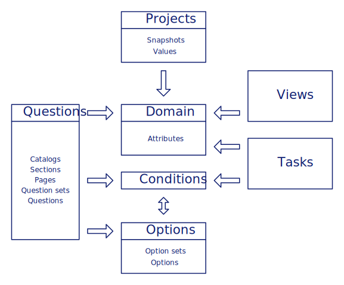

# Management

A freshly installed instance of RDMO is not very useful without a questionnaire to fill out by the user and a set of DMP templates later to be populated by the given answers. The main idea of RDMO is that every question and every output can be customized by you. This, however, introduces a certain level of complexity. RDMO employs a datamodel organized along different Django apps and models (representing database tables). A graphical overview is given in the figure below:


> *Overview of the RDMO data model*

Here, we explain the different parts of the data model. Each section has a link to a more detailed explanation how to create and edit the relevant elements.

For most users, the structured interview will be the most visible part of RDMO. It is configured using **catalogs**, **sections**, **questionsets**, and **questions**. A single installation of RDMO can have several catalogs. When creating a new project, a user can select one of these catalogs to be used with this project. A catalog has a number of sections, which themselves have question sets. Questions can be directly added to question sets. A question has a text, which will be shown in bold to the user and an optional help text. It also has a widget type, which determines which interface widget is presented to the user (e.g. text field, select field, radio buttons). The questionnaire is configured under `/questions` available in the management menu. More documentation about the questions management can be found [here](questions.html).

The **domain model** is the central part of the data model and connects the questions from the questionnaire with the user input. It is organized as a tree-like structure. Every piece of information about a user's project is represented by an **attribute**. In this sense these attributes can be compared to a variable in source code. Attributes are the leaves of the domain model tree, that organize the connections between the different entities assigned to them. Much like files are organized along directories on a disk. Every question or questionset set must have an attribute to be connected to. An example would be the attribute with the path `project/schedule/project_start` for the start date of the project. The attribute itself has the key `project_start` and resides in the attribute `schedule`, which itself is located in the `project`.

**Conditions** can be connected to questionsets. Conditions control if the questionsets are valid in the current context. If a questionset is not valid, it will not be shown to the user. Conditions are also needed to disable/enable option sets and tasks and can also be used in views. Conditions are configured with a source attribute, which will be evaluated, a relation like "equal" or "greater than", and a target. The target is a text string or an option. As an example, if the source is the attribute `project/legal_aspects/ipr/yesno`, the relation is "equal to", and the target text is "1". The condition will be true for a project where the answer to the question connected to the attribute `project/legal_aspects/ipr/yesno` is "1" (or "yes" for a yesno widget). Conditions configured under `/conditions` are available in the management menu. More documentation about the conditions management can be found [here](conditions.html).

**Views** allow for custom DMP templates in RDMO. To this purpose every view has a template which can be edited using the Django template syntax, which is based on HTML. Views have also a title and a help text to be shown in the project overview. Views are configured under `/views` available in the management menu. More documentation about editing views can be found [here](views.html).

After filling out the interview, the user will be presented with follow up **tasks** based on his/her answers. A task has a title and a text. **Time frames** can be added to tasks, which themselves are evaluating attributes of the value type "datetime", to use answers such as the beginning or the end of a project to compute meaningful tasks. Most of the time tasks will have a condition connected to them, to determine if this task is needed for a particular project or not. Tasks configured under `/tasks` are available in the management menu. More documentation about editing views can be found [here](tasks.html).

The different elements of the RDMO datamodel have various parameters, which control their behavior in RDMO and can be configured using the different management pages, which are described on the following pages. In addition, all elements contain a set of common parameters:

__*URI prefix*__

The URI prefix is the first part of the URI. As every element has a URI, every element does obviously also have a URI prefix. Semantically the prefix is only relevant when different RDMO instances share data between each other. In this case the URI prefix is used to determine which instance the data belong to. You may think of it as a kind of `unique instance identifier`.

When you import a question catalog or any other content from another institution these imports do have a URI prefix different from yours. If you change elements from these third party imports we strongly recommend to always adjust the URI prefix into your own one to make the changes persistent. This is necessary because a re-import of the third party content will overwrite by using the URI as identifier. Data in your database having the same URI as the imported ones will get updated and so overwritten. Please do also look into [Export and Import](export.html) page for a little more detail.

By convention the URI prefix has to look like a URL. It does not have to be a valid URL in terms of being resolvable. In principle you could use any kind of string as long as it fits the scheme but we recommend to use the URL of your RDMO instance. The URI prefix has to start with `http://` or `https://`. Afterwards there has to be a `host name`. Anything further like for instance a `path` is optional. Valid URI prefixes for example are: `https://rdmorganiser.github.io/terms` or `https://rdmo.aip.de`.

In edit forms of elements you will find a button looking like this . It can be used to automatically put the default URI prefix into the open form. This is very useful especially if you do not exactly remember or know the default value of your RDMO installation. The default URI prefix that this button gets is defined in the `local.py`. The button is only helpful if the value is set. We strongly recommend to add an entry like the following to your config of course having your URI prefix as value.

```
DEFAULT_URI_PREFIX = 'https://rdmo.uni-xyz.de/terms/'
```

__*Key*__

A key that is used as an internal identifier and determines, together with the URI prefix, the URI of the element.

__*Internal Comment*__

An internal comment to share information to be seen by users with access to the management backend.


```eval_rst
----

.. toctree::
   :maxdepth: 2

   questions
   domain
   options
   conditions
   views
   tasks
   export
   roles
```
