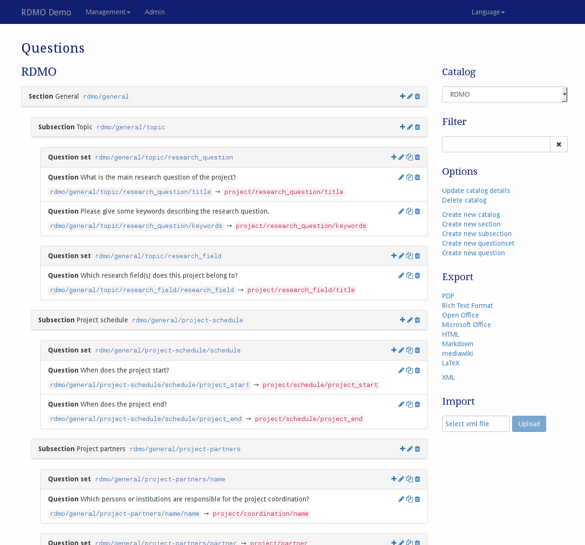

# Questions

The questions management is available under *Questions* in the management menu in the navigation bar. This page will be empty after a fresh RDMO installation. We suggest to **first import our domain model** and, if you like, our general questionnaire. The corresponding XML-files are available at <https://github.com/rdmorganiser/rdmo-catalog>.

If there is at least one questionnaire imported, it will be shown automatically. Other catalogs can be selected in the sidebar on the right-hand side afterwards.

> *Screenshot of the questions management interface*

On the left-hand side is the main display of sections, questionsets, and questions for the current catalog. For sections and questionsets the title and the key is shown. For questions and question set the key and the key of the attribute they are connected to is shown. The order of the different elements is the same as in the structured interview shown to the user. On the right side of each elements panel, icons indicate ways to interact the element. The following options are available:

* **Add** () a new section, a new questionset, or a new question.
* **Update** () an element to change its properties.
* **Copy** () an element. This will open a modal to set a new key. Afterwards, you can change the properties of the element using the update modal.
* **Export** () an element and all of its decendants as XML.
* **Delete** () an element and all of its decendants (e.g. a question set and all the questions it contains). **This action cannot be undone!**

The sidebar on the right-hand side shows additional interface items:

* **Catalog** switches the view to a different catalog.
* **Filter** filters the view according to a user given string or a given URI prefix.
* **Options** offers additional operations:
    * Update the details of the current catalog
    * Copy the the current catalog
    * Delete the current catalog
    * Create a new (empty) catalog
    * Create a new (empty) section
    * Create a new (empty) subsection
    * Create a new (empty) question set
    * Create a new (empty) question
* **Export** exports the current catalog to one of the displayed formats. While the text based formats are mainly for showing the full catalog, the XML export can be used to transfer this catalog to a different installation of RDMO.

The different elements of the questionnaire have different properties to control their behavior. As described in [the introduction](index.html), all elements have an URI prefix, a key, and an internal comment only to be seen by other managers of the RDMO installation. In addition, you can edit the parameters below:

## Parameters

### Catalog

|Name|Explanation|
|-|-|
|Order|Controls the position of the catalog in lists or in the interview|
|Title|The title for the catalog to be displayed to the user|
|Help|The title for the catalog to be displayed to the user|
|Groups|Displays the groups for this catalog. If at least one group is selected,   only users of thesegroups can select this catalog for a project.|
|Sites| (Only in a multi site installation) Displays the sites for this catalog.   Only users of thesegroups can select this catalog for a project.|

### Section

|Name|Explanation|
|-|-|
|Catalog|The catalog this section belongs to. Changing the catalog will move the section to a different catalog. Therefore it will not be visible in the current view anymore|
|Order|Controls the position of the section in lists or in the interview|
|Title|The title for the section to be displayed to the user|

### Question sets

|Name|Explanation|
|-|-|
|Section|The section this question set belongs to. Changing the section will move the question set into another section|
|Order|Controls the position of the question set in lists or in the interview|
|Questionset|Indicates the questionset that the questionset is connected to.  Questionsets in questionsets are displayed as blocks on the page|
|Attribute|Indicates the attribute that the questionset is connected to. Only used, if **Is collection** is activated. The attribute is used to store the value "in the tab",  e.g. `project/dataset/id`|
|Is collection|Designates whether this question set allows for separate answers for different sets (e.g. datasets, project partners)|
|Title|The title displayed for the sets, if **Is collection** is activated (e.g. dataset)|
|Help|The help text for the question. The help text will be shown in grey to the user|
|Verbose name|Name displayed for the sets, if **Is collection** is activated (e.g. datasets)|
|Verbose name plural|Plural name displayed for the sets, if **Is collection** is activated (e.g. datasets)|
|Conditions|Displays the conditions of the question set. If **all** selected conditions evaluate negative, the question set is skipped in the Interview|

### Questions

|Name|Explanation|
|-|-|
|Question set|The question set this question belongs to. Changing the question  set will move thequestion into another question set|
|Order|Controls the position of the question in lists or in the interview|
|Attribute|The attribute from the domain model this question is connected to.  The answersof the users will be connected to this attribute in the database  and tasks andviews reference answers using their attribute|
|Is collection|Designates whether this question allows for multiple answers. In this case  additional interface elements are added to the interview to add or remove  answers|
|Is optional|Designates whether this question is optional. In this case the question  is marked as optional to the user and excluded from the progress bar.|
|Widget type|The type of widget for the question. The following widgets can be selected: - **Text** (a one line text field) - **Textarea** (a multi-line text field) - **Yes/No** (a set of radio buttons for "Yes" and "No") - **Checkboxes** (a set of check boxes, the question needs to be a collection) - **Radio Buttons** (a set of radio buttons, the connected attribute &nbsp;&nbsp;needs to have an option set) - **Select drop down** (a drop down menu, the connected attribute needs to &nbsp;&nbsp;have an option set) - **Autocomplete** (a text field, which matches the typed content to an option) - **Range slider** (a horizontal slider, the question needs to have a range) - **Date picker** (a drop down element with a calendar to select a date, &nbsp;&nbsp;the connected attribute needs to have the value type datetime)|
|Value Type|Type of value for this attribute. The following types can be selected: Text, URL, Integer, Float, Boolean, Datetime, Options|
|Unit|Unit for this attribute. The unit will be displayed in the different output features|
|Width|Width for the widget of this question. A number from 1 to 12, the full with  is 12.Can be used to place questions side-by-side. |
|Text|The text for the question. The text will be shown in bold face to the user|
|Help|The help text for the question. The help text will be shown in grey to the user|
|Verbose name|Name displayed for different answers when **Is collection** is selected (e.g. item)|
|Verbose name plural| Plural name displayed for different answers when **Is collection** is selected (e.g. items)|
|Option sets|Displays the option sets of the question set. For the **Widget-Type** Checkboxes, Radio Buttons, and Select drop down the option sets contain the possible options for the answer|
|Conditions|Displays the conditions of the question. Questions will be hidden on the fly  if conditions do not apply anymore.|
|Maximum|Maximum value for the answer of this question, when using the **Widget-Type** Range-Slider|
|Minimum|Minimum value for the answer of this question, when using the **Widget-Type** Range-Slider|
|Step|Step in which the value of the answer can be incremented or decremented, when using the **Widget-Type** Range-Slider|
|Default answer text|The default answer text for this question. Default answers are shown  to the user and are stored on save.|
|Default option|The default option for this question.|
|Default external id|The default external id this question. Used with plugins.|
