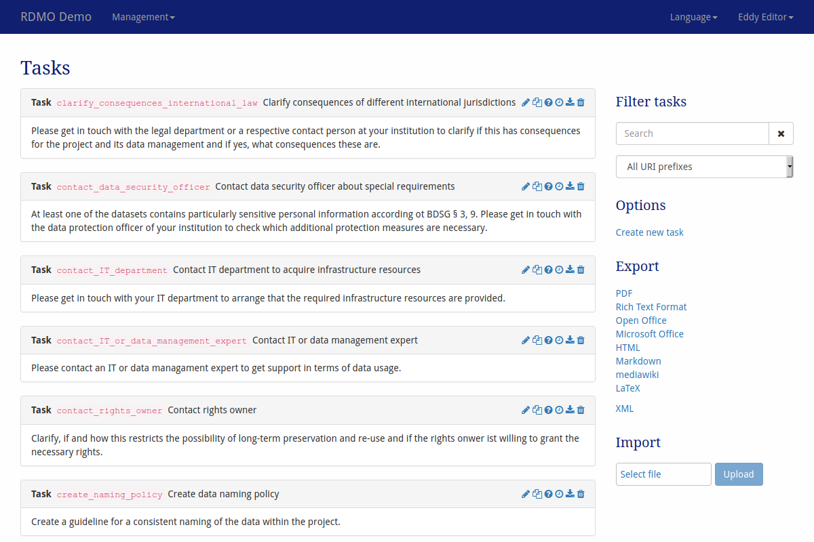

# Tasks

Tasks can be configured under *Tasks* in the management menu in the navigation bar.

> *Screenshot of the tasks management interface*

On the left-hand side is the main display of all the tasks available in this installation of RDMO. Tasks show their key, title and the text describing the task. On the right side of each tasks panel, icons indicate ways to interact the element. The following options are available:

* **Update** () a task to change its properties.
* **Copy** () a task. This will open a modal to set a new key.
* **Update conditions** () of a task. A task will only be shown to the user, if all of its conditions are evaluated `True`. The conditions themselved are configured in [the conditions management](../management/conditions.html).
* **Update the time frame** () of a task. The time frame is constructed from one or two dates from the user's answers. This allows for tasks about a specific deadline or special period.
* **Export** () a task as XML.
* **Delete** () a task. **This action cannot be undone!**

The sidebar on the right-hand side shows additional interface items:

* **Filter** filters the view according to a user given string or a given URI prefix.
* **Options** offers additional operations:
  * Create a new task
* **Export** exports the conditions to one of the displayed formats. While the textual formats are mainly for presentation purposes, the XML export can be used to transfer the tasks to a different installation of RDMO.

Tasks have different properties to control their behavior. As descibed in [the introduction](index.html), all elements have an URI prefix, a key, and an internal comment only to be seen by other managers of the RDMO installation. In addition, you can edit the parameters below:

## Parameters

### Task

|**Tab English**||
|-|-|
|Title|The English title for the task. The title will be shown in the projects overview.|
|Help|The English help text for the task. The help text will be shown in the projects overview|
|**Tab German**|*contains the same elements as the English one but obviously for German language content*|
|**Tab Groups**|
|Groups|Displays the groups for this task. If at least one group is selected, only users of these  groups will see this task for a project.|
|**Tab Sites**|
|Sites| *(Only in a multi site installation)* Displays the sites for this task. Only users of these  groups will see this task for a project.|

### Time frame

|Name|Explanation|
|-|-|
|Start date attribute|The attribute that sets the start date for this task. The attribute needs to be of value type *datetime*|
|End date attribute|The Attribute that sets the end date for this task (optional, if no end date attribute is given, the start date attribute sets also the end date). The attribute needs to be of value type *datetime*|
|Days before|Additional days before the start date|
|Days after|Additional days after the end date|
