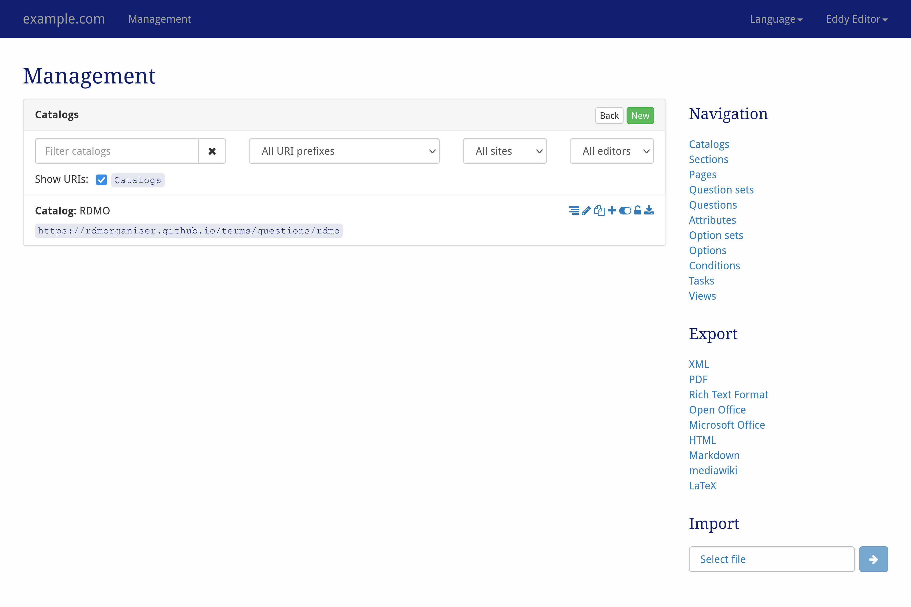

# Management user interface

Since Version 2.0, RDMO uses a general management interface. The page is accessible via the "Management" button in the navigation bar and will be empty after a fresh RDMO installation. We suggest to **first import our domain model** and, if you like, our general questionnaire. The corresponding XML-files that define the RDMO content are available and described at [rdmorganiser/rdmo-catalog](https://github.com/rdmorganiser/rdmo-catalog#rdmo-catalog).

> *Overview of the RDMO management interface*

Each content type in RDMO is referenced here as an element. Via the management interface an element can be selected and its available functions are displayed. The left-hand side shows the main display of the currently selected element. The panels represent individual items or entries for this element. On the right side in each panel, icons indicate ways to interact with this element. In general, the available interactions are listed below. However, some of the interactions are only available for specific elements.

* **Show a nested view** () for the element and its related elements.
* **Edit** () an element to change its properties.
* **Copy** () an element.
* **Add** () a new (sub-)element to the element.
* **Toggle the availability** () of the element.
* **Lock/unlock** () the element.
* **Export** () an attribute and all of its descendants as XML.

At the top of the page, the items of an element can be filtered based on a **text string**, the **URI Prefix**. For multi site setups, the site and the sites which can edit the element can also be used as filters.

The sidebar on the right-hand side shows additional interface items:

* **Navigation** switches the type of element which is currently listed in the main parts.
* **Export** exports the current catalog to one of the displayed formats. While the textual formats are mainly for presentation purposes, the XML export can be used to transfer the domain model to a different instance of RDMO.
* **Import** can be used to import a RDMO import file with elements.
